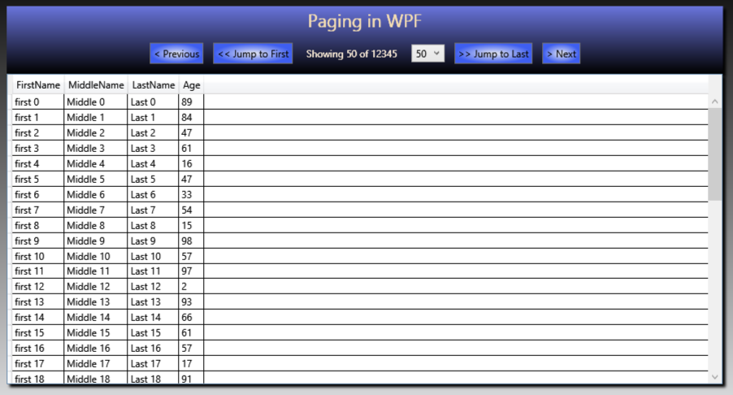

# Paging-WPF-DataGrid

This is an Example on Paging a WPF DataGrid with a DataTable. The DataGrid is interacted with by the user via buttons and the Code is simple and easy to replicate. Not yet fully generic.

This DataGrid Pager takes an IList (or Enumerable of any kind) of a specified class type and outputs the LINQ Query to a DataTable to be used in a DataGrid (or any other display that accepts a DataTable). The DataTable can be bound to the DataGrid in XAML, but for clarity this example does not do that. 

This Example is not fully generic (yet, still learning type properties) and will require modification for each list that this Pager is used on unless the list is fully generic.

If you can figure out how to convert the Paging Class into a fully generic operation accepting any range of type, Please Open a Pull Request!

The Repo is heavily commented. All of the Paging work is done in the Paging Class. 
